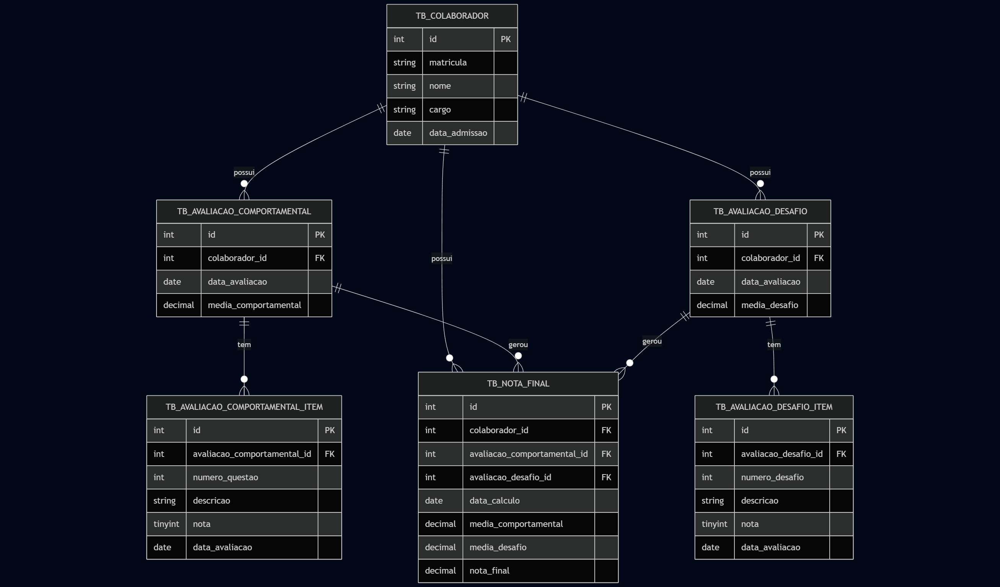

# Banco de dados
## Diagrama visual

## Tabelas

### `TB_COLABORADOR`
Armazena informações sobre cada colaborador da empresa.
- `id`: Identificador único do colaborador.
- `matricula`: Matrícula do colaborador (única).
- `nome`: Nome completo.
- `cargo`: Cargo ou função do colaborador.
- `data_admissao`: Data de admissão na empresa.

---

### `TB_AVALIACAO_COMPORTAMENTAL`
Guarda o conjunto de avaliações comportamentais de um colaborador em uma data específica.
- `id`: Identificador da avaliação.
- `colaborador_id`: Referência ao colaborador avaliado.
- `data_avaliacao`: Data em que a avaliação foi realizada.
- `media_comportamental`: Média das notas das questões comportamentais.

---

### `TB_AVALIACAO_COMPORTAMENTAL_ITEM`
Armazena cada questão individual de uma avaliação comportamental.
- `id`: Identificador do item.
- `avaliacao_comportamental_id`: Referência à avaliação comportamental.
- `numero_questao`: Número da questão (1 a 4).
- `descricao`: Texto da questão.
- `nota`: Nota atribuída (1 a 5).
- `data_avaliacao`: Data em que a avaliação foi realizada.

---

### `TB_AVALIACAO_DESAFIO`
Guarda o conjunto de avaliações de desafios de um colaborador em uma data específica.
- `id`: Identificador da avaliação de desafio.
- `colaborador_id`: Referência ao colaborador avaliado.
- `data_avaliacao`: Data em que a avaliação de desafio foi realizada.
- `media_desafio`: Média das notas dos desafios.

---

### `TB_AVALIACAO_DESAFIO_ITEM`
Armazena cada desafio individual de uma avaliação.
- `id`: Identificador do item.
- `avaliacao_desafio_id`: Referência à avaliação de desafio.
- `numero_desafio`: Número do desafio (1 a 4).
- `descricao`: Descrição ou nome do desafio.
- `nota`: Nota atribuída ao desafio (1 a 5).
- `data_avaliacao`: Data em que a avaliação foi realizada.

---

### `TB_NOTA_FINAL`
Armazena a nota final de um colaborador combinando avaliações comportamentais e de desafios.
- `id`: Identificador da nota final.
- `colaborador_id`: Referência ao colaborador avaliado.
- `avaliacao_comportamental_id`: Referência à avaliação comportamental associada.
- `avaliacao_desafio_id`: Referência à avaliação de desafio associada.
- `data_calculo`: Data em que a nota final foi calculada.
- `media_comportamental`: Média comportamental do colaborador.
- `media_desafio`: Média das avaliações de desafio.
- `nota_final`: Média final combinada (compartamental + desafio).