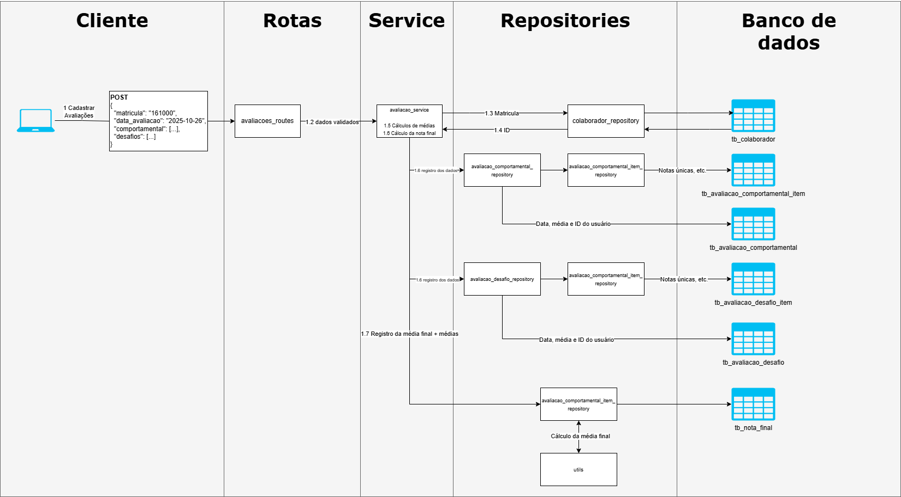

# Fluxo da aplicação

### Fluxo de Dados da API de Avaliações

1. O **usuário** envia para o **route de avaliação** os dados das avaliações juntamente com a matrícula do colaborador.
2. O **route** realiza a **validação dos dados** recebidos.
3. Após validação, o **route chama o service**, passando os dados da avaliação.
4. O **service** consulta o banco de dados para obter a **chave primária do colaborador** a partir da matrícula.
5. O **service calcula as médias** das avaliações **comportamentais** e de **desafios**.
6. O **service chama os repositórios** `avaliacao_desafio_repository` e `avaliacao_comportamental_repository` para **salvar as médias das avaliações**, a **data** e o **ID do colaborador** nas tabelas `tb_avaliacao_comportamental` e `tb_avaliacao_desafio`.
7. Os **repositórios** utilizam as **models** `AvaliacaoComportamentalItem` e `AvaliacaoDesafioItem` para **salvar as notas individuais** nas tabelas `tb_avaliacao_comportamental_item` e `tb_avaliacao_desafio_item`.
8. Por fim, o **service chama o `nota_final_repository`**, passando a **média final** de desafio e comportamental. O repositório **calcula a nota final** e a **salva na tabela `tb_nota_final`**.

## Exemplo visual de fluxo de dados para cadastrar avaliações
